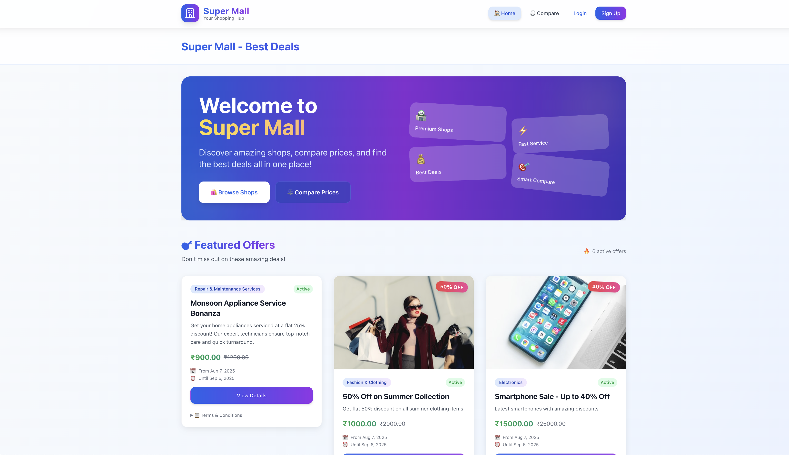
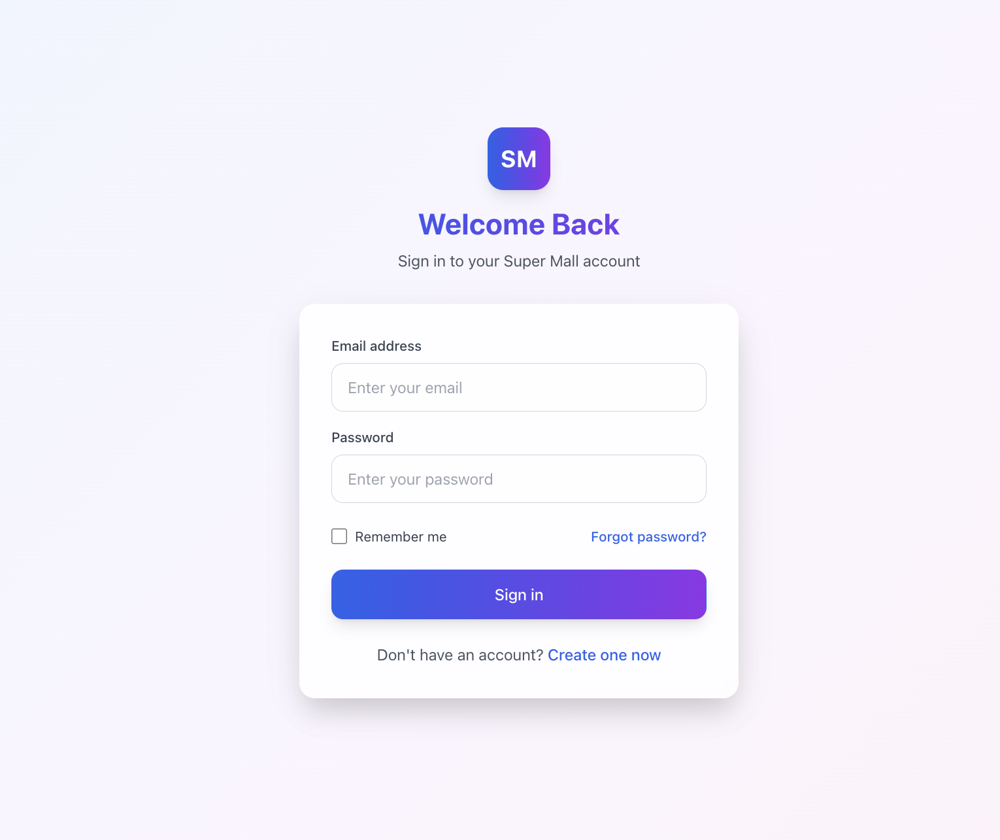
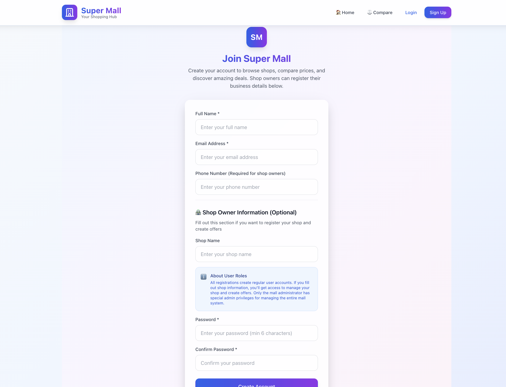
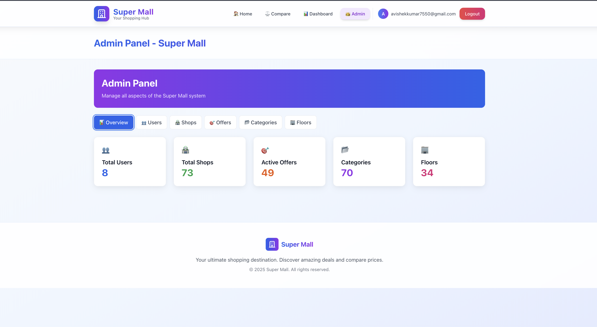
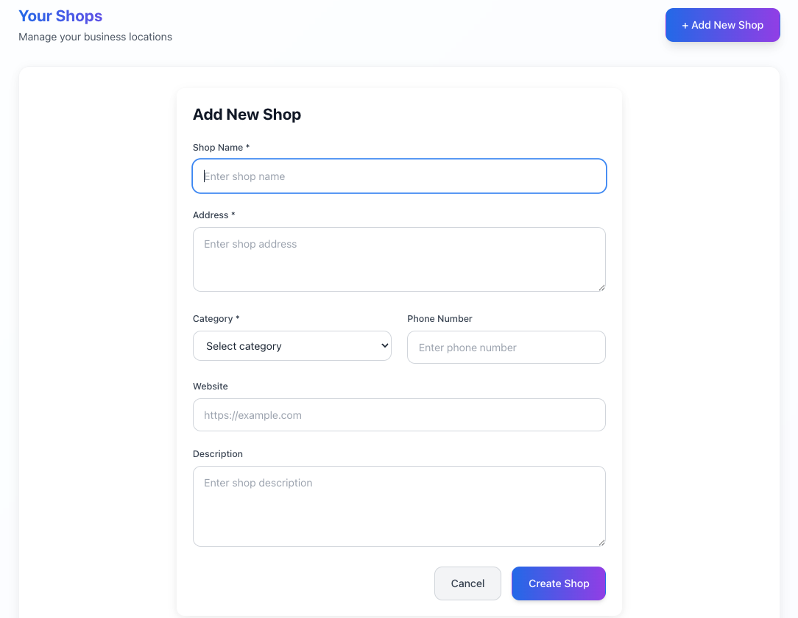
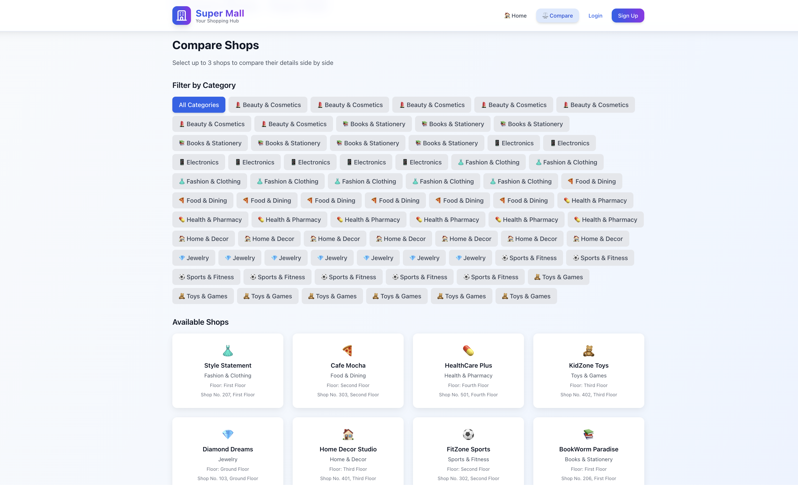

# 🛒 Super Mall Web App

>A modern, full-stack shopping mall management platform built with React, TypeScript, Vite, TailwindCSS, and Firebase. Designed for real-world deployment with comprehensive demo data and scalable for production use.

---

## 🌐 **Live Application**

### **🔗 Live Demo:** https://super-mall-web-app-32eaf.web.app

**Demo Credentials:**
- **Admin:** admin@supermall.com / Admin123!
- **User:** user@supermall.com / User123!

---

## 🚀 Project Overview

Super Mall Web App is a responsive, feature-rich platform for managing shops, offers, products, categories, and users in a shopping mall environment. It supports both admin and user roles, with secure authentication, real-time data, comprehensive demo data for showcasing, and a beautiful, mobile-first UI.

---

## ✨ Features
- **Authentication & Security:** Firebase Auth with role-based access control
- **Shop Management:** Complete CRUD operations with filtering and search
- **Offer Management:** Create, manage, and filter offers by shop/category/floor
- **Product Management:** Advanced product comparison with features and pricing
- **Category & Floor Management:** Organized navigation and filtering
- **User Dashboard:** Personalized dashboard with user-specific data
- **Admin Panel:** Comprehensive management interface for all platform data
- **Demo Data System:** Rich demo content for showcasing platform capabilities

## 🔒 Security & Evaluation Notice

**For Project Evaluators & Reviewers:**
- This repository does NOT contain actual Firebase API keys for security reasons
- Actual credentials are stored in `.env` files (gitignored)
- For evaluation purposes, please see [`FIREBASE_SETUP.md`](./FIREBASE_SETUP.md) for setup instructions
- Demo credentials can be provided upon request for evaluation
- The application includes mock mode for basic functionality testing
- **Responsive Design:** Mobile-first UI with TailwindCSS gradients and modern design
- **Real-time Data:** Live updates with Firebase Firestore
- **Comprehensive Testing:** 29+ automated tests with Vitest and React Testing Library
- **Production Ready:** Firebase Hosting deployment with proper security rules
- **Logging & Monitoring:** Complete audit trail for all CRUD operations

---

## 🛠️ Tech Stack
- **Frontend:** React 18, TypeScript, Vite
- **Styling:** TailwindCSS with modern gradients and responsive design
- **Backend/Database:** Firebase (Auth, Firestore, Storage, Security Rules)
- **Routing:** React Router DOM with protected routes
- **State Management:** React Context API with custom hooks
- **Testing:** Vitest, React Testing Library, JSDOM
- **Build Tools:** Vite with TypeScript configuration
- **Deployment:** Firebase Hosting with CI/CD ready
- **Development:** ESLint, PostCSS, modern development workflow

---

## 📁 Project Structure

```
Super_mall_web_app/
├── public/
│   └── vite.svg
├── src/
│   ├── assets/                    # Static assets and images
│   ├── components/               # Reusable React components
│   │   ├── AdminPanel.tsx       # Admin management interface
│   │   ├── ShopCard.tsx         # Shop display component
│   │   ├── OfferCard.tsx        # Offer display component
│   │   └── ProductCard.tsx      # Product display component
│   ├── contexts/                # React Context providers
│   │   └── AuthContext.tsx      # Authentication state management
│   ├── hooks/                   # Custom React hooks
│   ├── pages/                   # Main application pages
│   │   ├── Home.tsx            # Landing page
│   │   ├── Login.tsx           # Authentication page
│   │   ├── Dashboard.tsx       # User dashboard
│   │   ├── Shops.tsx           # Shop management
│   │   ├── Offers.tsx          # Offer management
│   │   ├── Products.tsx        # Product management
│   │   └── Compare.tsx         # Product comparison
│   ├── services/               # Firebase and API services
│   │   ├── firebase.ts         # Firebase configuration
│   │   ├── authService.ts      # Authentication services
│   │   ├── shopService.ts      # Shop CRUD operations
│   │   ├── offerService.ts     # Offer CRUD operations
│   │   ├── productService.ts   # Product CRUD operations
│   │   └── demoDataService.ts  # Demo data generation
│   ├── test/                   # Test utilities and mocks
│   ├── types/                  # TypeScript type definitions
│   │   └── index.ts           # Global type definitions
│   ├── App.tsx                 # Main application component
│   ├── main.tsx               # Application entry point
│   └── index.css              # Global styles and Tailwind imports
├── docs/                       # Project documentation
│   ├── screenshots/           # Application screenshots
│   ├── architecture/          # Architecture diagrams
│   └── reports/              # Project reports and analysis
├── firestore.rules            # Firebase security rules
├── package.json              # Dependencies and scripts
├── tailwind.config.js        # TailwindCSS configuration
├── vite.config.ts           # Vite build configuration
├── tsconfig.json            # TypeScript configuration
└── README.md                # Project documentation
```

---

## ⚡ Getting Started

### Prerequisites
- Node.js 18+ and npm
- Firebase account for backend services
- Git for version control

### Installation & Setup

1. **Clone the repository:**
   ```bash
   git clone https://github.com/Avishek-7/Super_mall_web_app.git
   cd Super_mall_web_app
   ```

2. **Install dependencies:**
   ```bash
   npm install
   ```

3. **Set up Firebase:**
   - Create a Firebase project at [firebase.google.com](https://firebase.google.com/)
   - Enable Authentication (Email/Password)
   - Create Firestore database
   - Enable Firebase Hosting (optional)
   - Add your Firebase config to `.env.local`:
     ```env
     VITE_FIREBASE_API_KEY=your_api_key
     VITE_FIREBASE_AUTH_DOMAIN=your_auth_domain
     VITE_FIREBASE_PROJECT_ID=your_project_id
     VITE_FIREBASE_STORAGE_BUCKET=your_storage_bucket
     VITE_FIREBASE_MESSAGING_SENDER_ID=your_sender_id
     VITE_FIREBASE_APP_ID=your_app_id
     ```

4. **Deploy Firestore security rules:**
   ```bash
   firebase deploy --only firestore:rules
   ```

5. **Start development server:**
   ```bash
   npm run dev
   ```

6. **Access the application:**
   - Open [http://localhost:5173](http://localhost:5173)
   - Create an account or login
   - Demo data will be automatically created for showcasing

### Available Scripts

```bash
npm run dev          # Start development server
npm test            # Run all tests
npm run build       # Build for production
npm run preview     # Preview production build
npm run deploy      # Deploy to Firebase Hosting
npm run lint        # Run ESLint
```

---

## 🧪 Testing & Quality Assurance

- **Comprehensive Test Coverage:** 29+ automated tests covering components, services, and user interactions
- **Testing Framework:** Vitest with React Testing Library for modern, fast testing
- **Test Categories:**
  - Component unit tests
  - Service layer integration tests
  - User interaction and workflow tests
  - Firebase service mocks and utilities
- **Quality Tools:** ESLint for code quality and TypeScript for type safety

### Running Tests
```bash
npm test              # Run all tests
npm run test:watch    # Run tests in watch mode
npm run test:coverage # Generate coverage report
```

Test utilities and mocks are available in `src/test/` for consistent testing patterns.

---

## 📸 Screenshots & Demo

### 🏠 Homepage

*Modern landing page with gradient design and feature highlights*

### 🔐 Authentication

*Secure login with validation and modern UI*


*User registration with form validation and secure signup process*

### ⚙️ Admin Panel

*Comprehensive admin interface for platform management*

### � Shop Management

*Complete shop creation form with category and floor selection*

### 🛍️ Shop Comparison

*Advanced shop comparison with features and details analysis*

### 🎯 Demo Data Features
- **Comprehensive Demo Content:** 70+ categories, multiple shops, offers, and products
- **User-Specific Data:** Personal dashboard with user's own shops and offers
- **Realistic Scenarios:** Complete shopping mall ecosystem for demonstration
- **Easy Setup:** Demo data automatically created for new users

> **Screenshots showcase the complete functionality of the Super Mall Web App with real data and professional UI design**

---

## 📄 Documentation & Resources

### Project Documentation
- [x] **Project Overview:** Complete feature list and capabilities
- [x] **Technical Stack:** Detailed technology breakdown and architecture
- [x] **Setup Guide:** Step-by-step installation and configuration
- [x] **Testing Documentation:** 29+ automated tests with coverage details
- [x] **Firebase Integration:** Complete Firestore structure and security rules
- [x] **Demo Data System:** Comprehensive demo content generation
- [x] **API Documentation:** Service layer and data flow documentation

### Additional Resources
- [📁] **Architecture Diagrams:** LLD and system design → See `/docs/architecture/`
- [📁] **Project Reports:** Final reports and analysis → See `/docs/reports/`
- [📁] **Screenshots & Wireframes:** Visual documentation → See `/docs/screenshots/`
- [📁] **Manual Test Cases:** User workflow testing → See `/docs/testing/`

### For Academic Submission
Complete documentation templates and resources are available in the `/docs` folder, including:
- Low-Level Design (LLD) documents
- Architecture diagrams and flowcharts
- Project report templates
- Test case documentation
- Screenshot guidelines

> **Production Ready:** All documentation follows industry standards and best practices

---

## 🗄️ Firebase Firestore Structure

```
Firestore Root
├── users (Collection)
│   └── {userId} (Document)
│        ├── email: string
│        ├── displayName: string
│        ├── role: 'admin' | 'user'
│        ├── createdAt: timestamp
│        └── updatedAt: timestamp
├── shops (Collection)
│   └── {shopId} (Document)
│        ├── name: string
│        ├── category: string
│        ├── floor: string
│        ├── address: string
│        ├── phone: string
│        ├── email: string
│        ├── ownerId: string (ref: users)
│        ├── isActive: boolean
│        ├── createdAt: timestamp
│        ├── updatedAt: timestamp
│        └── offers (Subcollection)
│             └── {offerId} (Document)
│                  ├── title: string
│                  ├── description: string
│                  ├── discount: number
│                  ├── validFrom: timestamp
│                  ├── validTo: timestamp
│                  ├── isActive: boolean
│                  ├── category: string
│                  └── createdAt: timestamp
├── offers (Collection) [Global Index]
│   └── {offerId} (Document)
│        ├── shopId: string (ref: shops)
│        ├── shopName: string
│        ├── title: string
│        ├── description: string
│        ├── discount: number
│        ├── validFrom: timestamp
│        ├── validTo: timestamp
│        ├── isActive: boolean
│        ├── category: string
│        ├── floor: string
│        └── createdAt: timestamp
├── products (Collection)
│   └── {productId} (Document)
│        ├── name: string
│        ├── description: string
│        ├── features: array<string>
│        ├── price: number
│        ├── originalPrice: number
│        ├── shopId: string (ref: shops)
│        ├── shopName: string
│        ├── category: string
│        ├── isAvailable: boolean
│        ├── imageUrl: string
│        └── createdAt: timestamp
├── categories (Collection)
│   └── {categoryId} (Document)
│        ├── name: string
│        ├── description: string
│        ├── icon: string
│        └── order: number
├── floors (Collection)
│   └── {floorId} (Document)
│        ├── name: string
│        ├── level: number
│        └── description: string
```

### Database Design Principles
- **Normalized Structure:** Separate collections for efficient querying
- **Denormalized Data:** Strategic duplication for performance (shopName in offers/products)
- **Security Rules:** Role-based access control with owner validation
- **Indexing:** Optimized for common query patterns (category, floor, active status)
- **Scalability:** Designed for horizontal scaling and real-time updates
- **Demo Data Integration:** Rich sample data across all collections for showcasing

### Security Rules Overview
- **Users:** Can only read/write their own profile data
- **Shops:** Public read access, authenticated write access with owner validation
- **Offers:** Public read access for discovery, owner-only write access
- **Products:** Public read for comparison, authenticated write access
- **Categories/Floors:** Public read, admin write access

---

## 🚀 Production Deployment

### Firebase Hosting
The app is configured for seamless deployment to Firebase Hosting:

```bash
npm run build    # Build production bundle
npm run deploy   # Deploy to Firebase Hosting
```

### Environment Configuration
- Production environment variables in `.env.production`
- Staging environment support with `.env.staging`
- Development environment with `.env.local`

### Performance Optimizations
- **Code Splitting:** Automatic route-based code splitting with React Router
- **Bundle Optimization:** Vite's production optimizations and tree shaking
- **Image Optimization:** Optimized assets and lazy loading
- **Caching Strategy:** Firebase Hosting CDN with proper cache headers

---

## 🏗️ Architecture & Design Patterns

### Frontend Architecture
- **Component-Based:** Modular, reusable React components
- **Context API:** Global state management for authentication and user data
- **Custom Hooks:** Reusable logic for data fetching and state management
- **Service Layer:** Clean separation between UI and business logic

### Backend Architecture
- **Serverless:** Firebase Functions for complex operations (future expansion)
- **Real-time Database:** Firestore with real-time subscriptions
- **Authentication:** Firebase Auth with role-based access control
- **Security:** Comprehensive Firestore security rules

### Design Patterns
- **Repository Pattern:** Service layer abstraction for data operations
- **Observer Pattern:** Real-time data updates with Firestore listeners
- **Factory Pattern:** Demo data generation with configurable parameters
- **Provider Pattern:** React Context for dependency injection

---

## 🤝 Contributing

We welcome contributions! Here's how you can help:

### Development Setup
1. Fork the repository
2. Create a feature branch: `git checkout -b feature/amazing-feature`
3. Make your changes and add tests
4. Run the test suite: `npm test`
5. Commit your changes: `git commit -m 'Add amazing feature'`
6. Push to your branch: `git push origin feature/amazing-feature`
7. Open a Pull Request

### Contribution Guidelines
- **Code Quality:** Follow TypeScript best practices and ESLint rules
- **Testing:** Add tests for new features and maintain coverage
- **Documentation:** Update README and code comments as needed
- **Commit Messages:** Use conventional commit format
- **Pull Requests:** Provide clear description and link to issues

### Development Workflow
- **Issue First:** Create or find an issue before starting work
- **Branch Strategy:** Use feature branches for all changes
- **Code Review:** All changes require review before merging
- **Continuous Integration:** Automated testing on all pull requests

---

## 📞 Support & Contact

### Getting Help
- **Issues:** Report bugs and request features on [GitHub Issues](https://github.com/Avishek-7/Super_mall_web_app/issues)
- **Discussions:** Join community discussions on [GitHub Discussions](https://github.com/Avishek-7/Super_mall_web_app/discussions)
- **Documentation:** Check the `/docs` folder for detailed guides

### Project Status
- **Version:** 1.0.0 (Production Ready)
- **Maintenance:** Actively maintained
- **License:** MIT License
- **Contributors:** Open to community contributions

---

## 📝 License

This project is licensed under the MIT License - see the [LICENSE](LICENSE) file for details.

### Open Source Notice
This project is open source and available under the MIT License. You are free to use, modify, and distribute this software for personal and commercial purposes.

---

## 🏆 Acknowledgments

- **React Team:** For the excellent React framework
- **Firebase Team:** For the comprehensive backend platform
- **TailwindCSS:** For the utility-first CSS framework
- **Vite Team:** For the fast build tool and development experience
- **Community:** All contributors and users who help improve this project

---

*Built with ❤️ by [Avishek Kumar](https://github.com/Avishek-7) - A modern shopping mall management platform showcasing full-stack development skills with React, TypeScript, and Firebase.*
